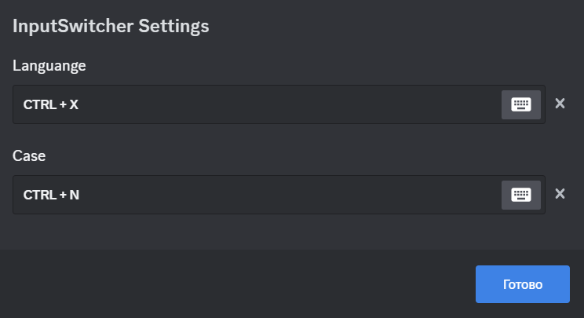

# InputSwitcher
Switches the keyboard layout(RU & EN)/case of the message.

## Features

### Context menu
Adds "Switch" buttons to the context menus of the message and text input. If you clicked on your message, it will be edited, if not, a pop-up window with the changed text will appear.

### Hotkeys
Hotkeys for changing text in text input(channel text input/edit message input)

Default hotkey settings:
* CTRL + X: swap languange
* CTRL + N: swap case

# Requirements: 
- [BDFDB](https://mwittrien.github.io/downloader/?library)

It will be downloaded automatically
